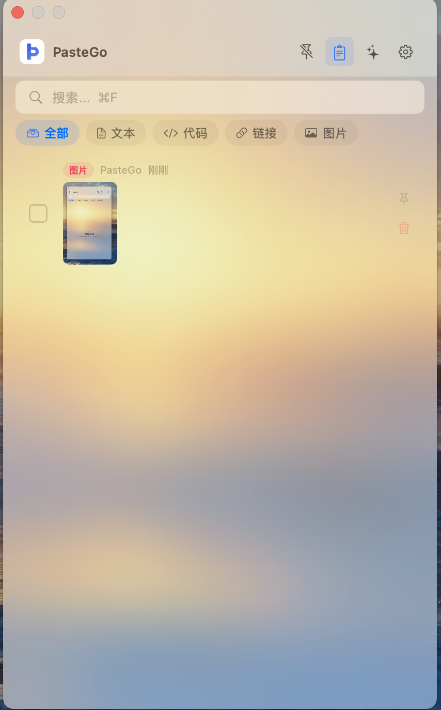
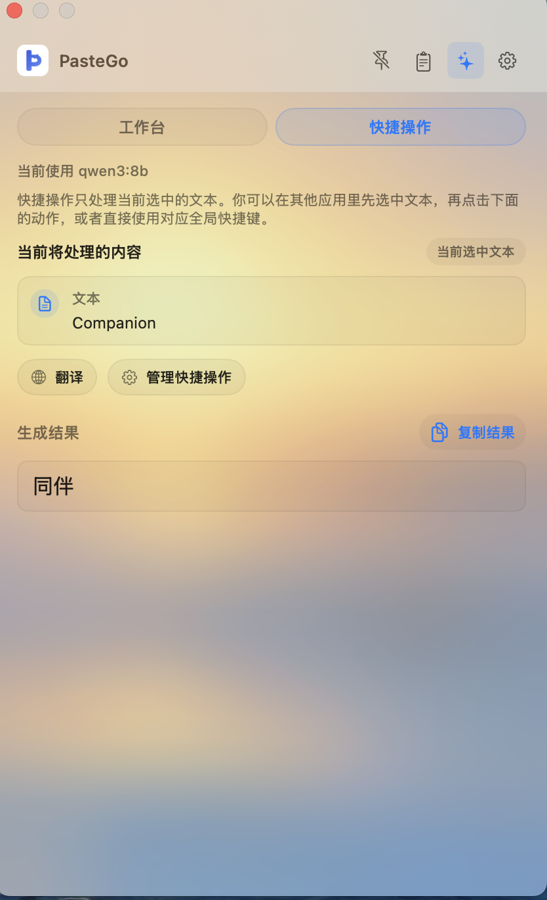
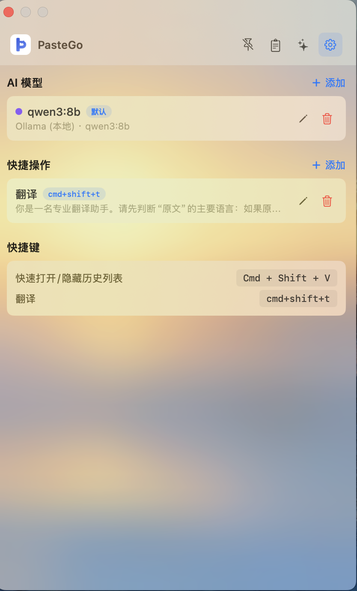

# PasteGo

macOS 剪贴板 AI 助手 — 原生 Swift/SwiftUI 构建，自动记录剪贴板历史，一键调用本地 AI 处理文本。


## 截图

<p align="center">
  
  
  
</p>

## 功能特性

- **剪贴板历史** — 自动监听并记录文本、代码、链接、图片，支持搜索和分类筛选
- **快捷操作** — 自定义 AI 提示词模板（翻译、总结、改写等），选中文本一键处理
- **全局快捷键** — 为模板绑定快捷键，在任意 App 中按下即可调用 AI 处理当前选中文本
- **本地 AI** — 支持 Ollama 本地模型，数据完全不出本机
- **多 AI 后端** — 同时支持 OpenAI、Claude 等云端服务
- **流式输出** — 实时逐字显示生成结果，支持 Markdown 渲染
- **隐私优先** — 数据全部存储在本地 SQLite，不上传任何内容
- **原生体验** — 纯 Swift/SwiftUI 构建，轻量快速，完美适配 macOS 风格

## 安装

### 下载安装

前往 [Releases](https://github.com/mrzch03/PasteGoNative/releases) 下载最新的 `.dmg` 文件，拖入 Applications 即可。

> 首次打开前，需要在终端运行以下命令（去除 macOS 隔离标记）：
> ```bash
> xattr -cr /Applications/PasteGo.app
> ```

### 从源码构建

```bash
# 克隆仓库
git clone https://github.com/mrzch03/PasteGoNative.git
cd PasteGoNative

# 使用 XcodeGen 生成项目（需先安装 brew install xcodegen）
xcodegen generate

# 用 Xcode 打开并构建
open PasteGo.xcodeproj
```

**前置要求：** Xcode 16+、macOS 14.0+

## 使用指南

| 快捷键 | 说明 |
|--------|------|
| `Cmd + Shift + V` | 快速打开/隐藏历史列表 |
| `Cmd + Shift + T` | 翻译当前选中文本 |

### 剪贴板历史

启动后自动监听剪贴板，所有复制的内容都会出现在历史列表中。支持按类型筛选（全部 / 文本 / 代码 / 链接 / 图片）。

### 快捷操作

在其他 App 中选中文本，按下对应的全局快捷键，PasteGo 自动弹出并用 AI 处理当前选中内容，结果一键复制。

### 设置

- 添加/管理 AI 模型（Ollama 本地模型、OpenAI 等）
- 创建/编辑快捷操作模板
- 自定义全局快捷键绑定

## 技术栈

- **语言：** Swift 5.10
- **UI 框架：** SwiftUI
- **数据库：** SQLite ([GRDB.swift](https://github.com/groue/GRDB.swift))
- **快捷键：** [HotKey](https://github.com/soffes/HotKey)
- **Markdown：** [MarkdownUI](https://github.com/gonzalezreal/swift-markdown-ui)
- **项目管理：** [XcodeGen](https://github.com/yonaskolb/XcodeGen)

## License

[MIT](LICENSE)
